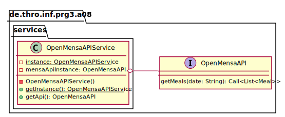
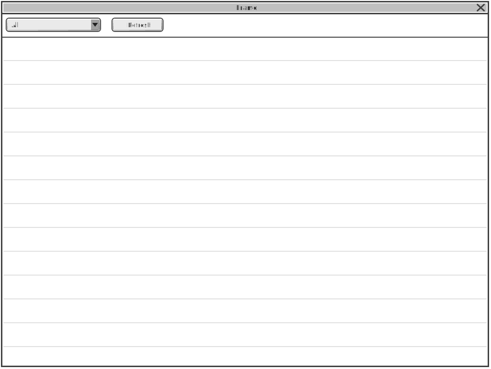
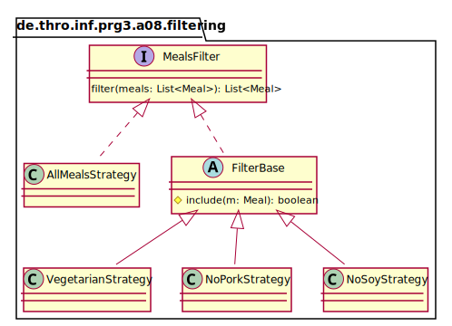
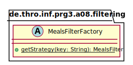

_This is an assignment to the class [Advanced Programming](https://hsro-inf-fpk.github.io) at the [University of Applied Sciences Rosenheim](http://www.th-rosenheim.de)._

# Assignment 8: Singleton-, factory- and strategy pattern

In this assignment, we will refactor and extend the app we started to implement in the last assignment.

## Setup

1. Create a fork of this repository (button in the right upper corner)
2. Clone the project (get the link by clicking the green _Clone or download button_)
3. **This assignment requires at least JDK11 or newer! Make sure that you have JDK11 installed on your machine and the environment variables `JAVA_HOME` and `JDK_HOME` set accordingly.**
4. In case you want to run it with JDK1.8 (Java 8), you can check out the `master-8` branch!  

## Singleton Pattern

As already explained in the lecture a singleton is an object which is accessible in your whole application at any time.
To avoid having to create a new instance of the API proxy again and again we want to implement a singleton that holds an instance of the `OpenMensaAPI` interface we implemented last time.

The following UML shows **one possibility** how this may be accomplished:



Afterwards you can use the singleton like this:

```java
OpenMensaAPIService svc = OpenMensaAPIService.getInstance();
OpenMensaAPI apiInstance = svc.getApi();

apiInstance.getMeals(...)...
```

_Remark: IntelliJ is capable to generate singletons for you. Check the "Kind" dropdown in the class creation dialog_

## Strategy and Factory Pattern - Filters

Until now, we were only able to filter for vegetarian food.
This time we want to extend the filter capabilities of our app.
The following wireframe shows the new layout of our app:



JavaFX offers two different controls to implement a dropdown:

* `ChoiceBox<T>`
* `ComboBox<T>`

The difference is that a `ChoiceBox<T>` only calls `toString()` on each element it is representing while it is possible to add a `CellFactory` to a `ComboxBox<T>` instance to define a custom behavior how to display every item.
As we only want to display static strings to distinguish between different filter options a `ChoiceBox<T>` is totally sufficient for this assignment.

Additionally to the already implemented vegetarian filter of the last assignment we want to introduce the following filtering choices:

* **All** - no elements are filtered (the default)
* **No pork** - show all meals except those containing pork
* **No soy** - show all meals except those containing soy  

To implement the filter mechanism we could just extend the existing logic by adding some more `if-else` statements.
This approach isn't very flexible and results in a huge code statement which isn't readable any more so that's not what we want.
The strategy pattern is always a good choice if you have different implementations giving you the same **kind** of result (e.g. all implementations return a list of meals).

The following UML is meant as an implementation advise.
You don't have to implement it this way but it might result in less code (and save you time).
It is also a nice application of inheritance to avoid duplicates and reduce the amount of code.



_Additional explanations: To avoid duplicate code (DRY - don't repeat yourself!) you can extract the code to iterate over the list of meals and collect matching meals to an `abstract` base class `FilterBase` where you pass every meal to an `protected abstract` method which decides if the meal should be included or not. The `AllMealsStrategy` is handled otherwise because this strategy does not have to filter anything._

The remaining problem is how to get an instance of the currently required strategy.
This is where the factory pattern comes into play.



A factory's responsibility is to instantiate and manage instances of different implementations of the same base class or interface.
There are different options to control which implementation is returned by the factory (e.g. enums, string keys, dumb integers, environment variables and a few more).
To get the currently selected item from a `ChoiceBox<T>`, a `ChoiceBox<T>` instance exposes the `getSelectionModel()` method.
The selection model has two methods `getSelectedIndex()` and `getSelectedItem()`.
The selected item should be used to select the corresponding strategy by passing the string to the `getStrategy(...)` method of the `MealsFilterFactory`.

1. Declare the interface `MealsFilter`
2. Implement the `AllMealsStrategy` class
3. _Optionally:_ implement the `FilterBase` class (it's totally fine for now to implement all filters without an base class)
4. Implement the filters `VegetarianStrategy`, `NoPorkStrategy`, `NoSoyStrategy`
5. Implement the `FilterFactory` class

_Remark: again the given UML for the FilterFactory is just a recommondation. You don't have to stick to this draft._

_Side note: you could implement the `getStrategy(String key)` method by doing a `switch` on the `key` parameter but it's also possible to solve it with a `Map` instance which holds the known keys and corresponding implementations and is initialized in a so called "static constructor":_

```java
public abstract class MyHelper {
    private static final String ANY_CONSTANT;

    //static constructor
    static {
        ANY_CONSTANT = "Hello, World!";
    }
}
```

## Wire up all components

After implementing all filters and the `OpenMensaAPIService` singleton the only thing left is to add an `onAction` handler to the `ChoiceBox` which does:

* selecting the right filtering strategy
* applying the filter
* updating the `ListView` to display the filtered meals

Keep in mind that a proper fallback if no valid filter is selected might be a good idea.
